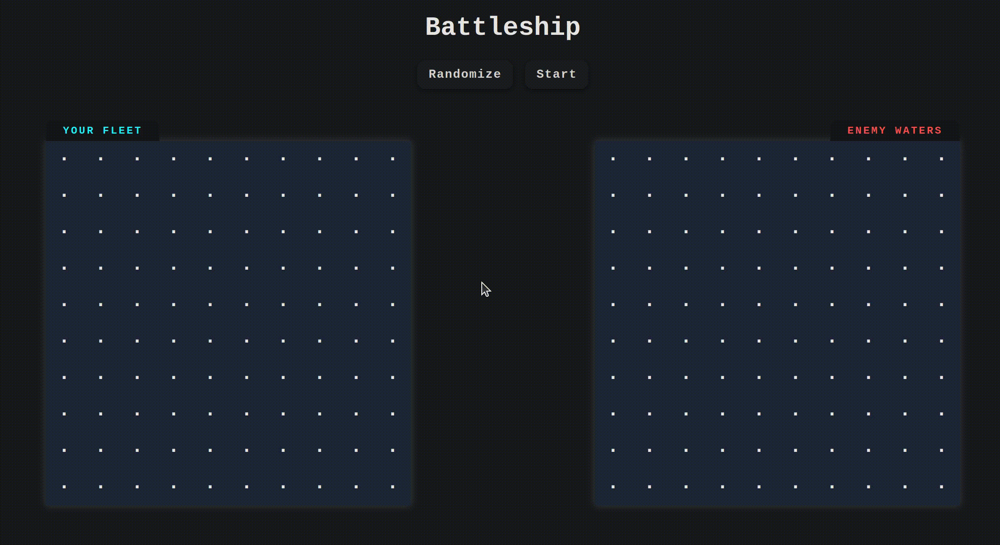

# Battleship

A modern, full-stack implementation of the classic Battleship game with both single-player (vs AI) and multiplayer modes.



## Features

- **Singleplayer Mode**: Play against a smart AI opponent with probabilistic attack strategy using heatmaps and simulation
- **Multiplayer Mode**: Play against friends in real-time
- **Interactive Grid**: Place ships manually or automatically populate your board
- **Modifiable Game Speed**: Choose how long the AI takes to attack, making for lightning fast or slow and methodical gameplay
- **Real-time Updates**: Instant feedback via WebSocket communication

## Tech Stack

### Backend

- **Framework**: Fastify
- **Real-time Handling**: Socket.IO
- **Language**: TypeScript
- **API Documentation**: Swagger/OpenAPI
- **Testing**: Vitest

### Frontend

- **Framework**: React
- **Language**: TypeScript
- **Styling**: Custom CSS
- **Build Tool**: Vite

## Getting Started

### Prerequisites

- Node.js 18.x or higher
- npm

### Installation

1. **Clone the repository**

    ```bash
    git clone git@github.com:Ray-AS/battleship-multiplayer.git
    cd battleship-multiplayer
    ```

2. **Install backend dependencies**

    ```bash
    cd backend
    npm install
    ```

3. **Install frontend dependencies**

    ```bash
    cd ../frontend
    npm install
    ```

### Running the application

1. **Start the backend server**

    ```bash
    cd backend
    npm run dev
    ```

    Server runs on `http://localhost:3000`
  
2. **Start the frontend instance (in a new terminal)**

    ```bash
    cd frontend
    npm run dev
    ```

    Client runs on `http://localhost:5173`
  
3. **Open your browser**: Navigate to `http://localhost:5173`
    - Play against an AI
    - Create another client instance to play multiplayer

## How to Play

### Game Rules

1. Each player has a 10x10 grid
2. Players place 5 ships of varying lengths:
    - Carrier (5 cells)
    - Battleship (4 cells)
    - Cruiser (3 cells)
    - Submarine (3 cells)
    - Destroyer (2 cells)
3. Players take turns attacking opponent's grid
4. First player to sink all opponent ships wins

### Game Flow

#### Singleplayer

1. Click "Play Vs. Computer"
2. Either:
    - Click "I'm Ready" for random ship placement, or
    - Click "Place Ships Manually" to position ships yourself
3. Attack enemy waters by clicking cells
4. AI automatically counterattacks after each turn

#### Multiplayer

1. **HOST**: Click "Create Multiplayer Game"
    - Share the Game ID with your opponent
2. **JOIN**: Click "Join Multiplayer Game"
    - Enter the Game ID
3. Both players place ships, then click "I'm Ready" (or click "I'm Ready" without placing for random placements)
4. Take turns attacking opponent's grid

##### Currently only supports multiplayer using local server; live deployment coming soon

##### AI Strategy

- **Tracks Board State**: Keeps track of hits, misses, and sunk ships to avoid attacking the same positions twice
- **Heatmap Simulations**: Runs multiple simulations of all possible placements for remaining ships, generating a probability map to identify the most likely positions for ships.
- **Adaptive Targeting**: Focuses attacks around known hits to efficiently sink ships and updates its strategy dynamically as ships are sunk
- **Randomized Fallback**: If no high-probability targets are available, it selects from remaining unknown cells, adding unpredictability and making gameplay feel natural

  ```typescript
  // Simplified AI decision flow
  chooseAttack() {
    const heatmap = this.generateHeatmap(300); // Run 300 simulations
    const bestPosition = findHighestProbability(heatmap);
    return bestPosition || chooseRandom();
  }

## API Documentation

### REST Endpoints

| METHOD | ENDPOINT             | DESCRIPTION                                           |
|--------|----------------------|-------------------------------------------------------|
| GET    | `/game/:id`          | Get current game state                                |
| POST   | `/game/:id`          | Create or join a game session                         |
| POST   | `/game/:id/place`    | Place a ship on the board during setup phase          |
| POST   | `/game/:id/start`    | Mark player as ready and start game when all ready    |
| POST   | `/game/:id/attack`   | Attack a position on opponent's board                 |

### WebSocket Events

#### Client → Server

| EVENT        | PAYLOAD                                                        | DESCRIPTION                              |
|--------------|----------------------------------------------------------------|------------------------------------------|
| `joinGame`   | `{ gameId: string, playerId: string }`                         | Join a game room and sync state          |
| `startGame`  | `{ gameId: string, playerId: string }`                         | Mark player ready to begin               |
| `attack`     | `{ gameId: string, attackerId: string, x: number, y: number }` | Attack opponent at coordinates     |
| `clearShips` | `{ gameId: string, playerId: string }`                         | Clear all placed ships during setup      |
| `disconnect` | `(automatic)`                                               | Client disconnected from server          |

#### Server → Client

| EVENT               | PAYLOAD                                                  | DESCRIPTION                                    |
|---------------------|----------------------------------------------------------|------------------------------------------------|
| `gameState`         | `{ gameId, phase, turn, boards, isMultiplayer, ... }`    | Complete game state update                     |
| `playerJoined`      | `{ playerId: string, participantCount: number }`         | Another player joined the game                 |
| `playerReady`       | `{ message: string }`                                    | Current player marked as ready                 |
| `playerMarkedReady` | `{ playerId: string }`                                   | Another player marked themselves as ready      |
| `error`             | `{ message: string }`                                    | Error message for invalid action               |
| `shipsCleared`      | `{ success: true, board: Board[][] }`                    | Ships successfully cleared from board          |

## Testing

- **Unit Tests (Game Logic)**: Ship, Gameboard, Player, Computer classes
- **Integration Tests**: Controllers, Routes (*Currently a little outdated)
